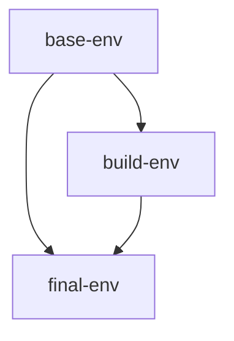

# Initialize with Docker

[](https://github.com/abnt-latex/docker/actions)

## Para usar a imagem (`Package`)

* [TeXLive and R](https://github.com/orgs/abnt-latex/packages/container/package/texlive-r)

```bash
docker pull ghcr.io/abnt-latex/texlive-r:latest
```

## Para construir de forma manual



### Container

```bash
docker run --name texlive-r -it --rm -v /$(pwd)/<the-folder-project>:/content -w /content texlive-r:debian /bin/bash
```

### Compilar

```bash
./build.sh --dir=${ FOLDER } --file=${ FILE } --mode=${ complete | bib | simple } --simplify # in root
# OR to execute complete mode
pdflatex --interaction=batchmode ${ MAIN_FILE }
bibtex ${ MAIN_FILE }
makeindex ${ MAIN_FILE }.idx
makeglossaries ${ MAIN_FILE }
pdflatex --interaction=batchmode ${ MAIN_FILE }
pdflatex --interaction=nonstopmode ${ MAIN_FILE } | grep ...
# OR
# https://ctan.org/pkg/latexmk
latexmk -pdf ${ MAIN_FILE }
```

### Workflow Github

> [!NOTE]
> Necessário atualizar o [personal access token](https://docs.github.com/en/authentication/keeping-your-account-and-data-secure/managing-your-personal-access-tokens) (PAT) do repositório.